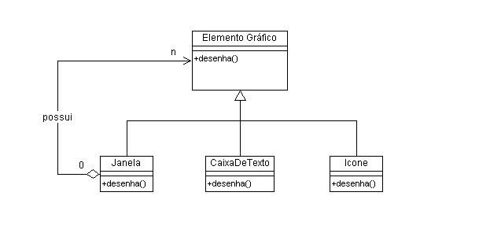

# Composite

## Composite - Padrão Estrutural;

* Integra objetos em estruturas de árvore para representar hierarquias completas;
* O Composite permite que os clientes tratem objetos individuais e composições de objetos uniformemente;
* Composição recursiva;
* Os diretórios contêm entradas, cada uma das quais pode ser um diretório também.

A ideia do Composite é criar uma classe base que contém toda a interface necessária para todos os elementos e criar um elemento especial que agrega outros elementos.
As classes e objetos participantes nesse padrão são:
* Componente
* Folha
* Composite
* Cliente

Por exemplo, em interfaces gráficas, um elemento gráfico pode ser formado pela composição de vários outros elementos. Uma página de internet pode conter um ou mais ícones, além de caixas de texto e vários outros elementos. Considerando que uma determinada hierarquia de classes indica um Elemento Gráfico como, portanto, a super-classe—comum à todas classes que representam elementos gráficos atômicos. Assim, a "página" pode ser representada tanto como uma classe que contém zero ou mais elementos gráficos.

Diagrama de exemplo:

[Código de exemplo](sample.java)
