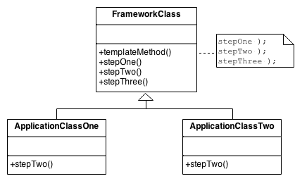

# Template Method
## Template Method - Padrão Comportamental

* Defina o esqueleto de um algoritmo em uma operação, adiando algumas etapas para as subclasses do cliente. O método de modelo permite que as subclasses redefinam certas etapas de um algoritmo sem alterar a estrutura do algoritmo.
* A classe base declara 'marcadores de posição' do algoritmo e as classes derivadas implementam os marcadores de posição.

1. Considere um framework para aplicações que fornece as classes Application e Document. A classe Application é responsável por abrir documentos existentes armazenados num formato externo, tal como um arquivo. Um objeto Document representa a informação num documento, depois que ela foi lida do arquivo.
2. As aplicações construídas com o framework podem criar subclasses de Application e Document para atender necessidades.
3. A classe abstrata Application define o algotritmo para abrir e ler um documento na sua operação OpenDocument. OpenDocumento define cada passa para a abertura de um documento. Ela verifica se o documento pode ser aberto, cria o objeto Document específico para a aplicação, acrescenta-o ao seu conjunto de documentos e lê Document de um arquivo.
4. Chamamos OpenDocument um template method. Um método-template define um algoritmo em termos da operação abstrata que as subclasses redefinem para fornecer um comportamento concreto. As subclasses da aplicação definem os passos do algoritmo que verifica se o documento pode ser aberto e cria o Document. As classes Document definem a etapa que lê o docunento. O método template também define uma operação que permite às subclasses de Application saberem quando o documento está para ser aberto, no caso de elas term essa preocupação.
5. Pela definição de alguns dos passos de um algoritmo usando operações abstratas, o método template fixa a sua ordem, mas deixa as subclasses de Application e Document variarem aqueles passos necessários para atender suas necessidades.

[Exemplo de código](sample.java)
